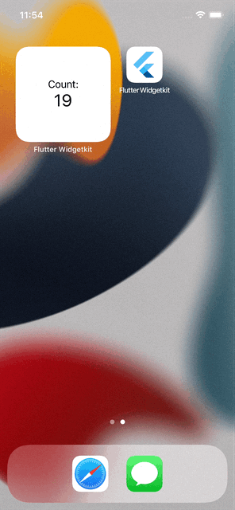

## Displaying SQLite data from Flutter app on iOS home-screen screen with Swift's WidgetKit

In this repository, you will find the source code of the application, which shows how to display your data from the Flutter application on the iPhone home screen.

Please refer to this free [article on Medium for more info](https://tsinis.medium.com/displaying-sqlite-data-from-the-flutter-app-on-the-ios-home-screen-ea62965c92a6).

